# Umlsequence Syntax

All diagrams in this directory were creating by running:
`umlsequence2 README.md -m`.

See also [examples](../examples/README.md).

## 1. Creating objects, actors, and simple messages

Objects and actors:

- Use the syntax `ID : Display name` to create an object. The `ID`
  will be used as reference to the object throughout the diagram.
- Similarly, use the syntax `ID * Display name` to create an actor.
- The ID consists of one letter, followed by zero or more letters,
  digits, or underscore.

Messages:

- Use the syntax `ID1 -> ID2` to create a simple message between two
  objects.
- Use the syntax `ID1 -> ID2 TEXT` to add a message text.
- Use the syntax `ID1 => ID2 TEXT` to create a return message.
- The arrow can be reversed, so `ID1 -> ID2` is equivalent to
  `ID2 <- ID1`.
- For async message, add `?` to the arrow tail: `ID1 ?-> ID2`.
- Any message auto-advances the time.

```umlsequence 01.svg
U  * User
O1 : Object 1
O2 : Object 2

U  ->  O1
O1 ->  O2  message
O1 <=  O2  return
U  <-? O1  async message
```


## 2. Source layout, comments

- Extraneous whitespaces, newlines, and arrow shaft characters are ignored.
- Lines beginning with `#` are comments.

It is thus possible to add some layout effects to the source code.

The following code is equivalent to the previous one:
```umlsequence 02.svg
# Objects
U  * User
             O1 : Object 1
                            O2 : Object 2

# Messages
U  -------->  O1
              O1 -------->  O2  message
              O1 <========  O2  return
U  <-------?  O1                async message
```
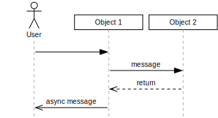

## 3. Lifeline activations, time step

### 3.a. Basic activations

- Use `ID+` and `ID-` to activate and deactivate an object.
- Use `ID!` to activate an object just briefly (blip).
- `ID+`, `ID-` and `ID!` may be declared on the same line.
- The `+` and `-` do not advance the time, except if it would produce a
  zero-height activation
- To advance the time by one step, use `:`.

```umlsequence 03a.svg
O1 : Object 1
O2 : Object 2

O1+ O2+
O2- O1-
```


### 3.b. Blip

```umlsequence 03b.svg
O : Object

O!
```
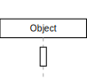

### 3.c. Activation combined with message

- The `+`, `-` and `!` can be combined with a message.

```umlsequence 03c.svg
O1 : Object 1
O2 : Object 2

O1+ -> O2!
```
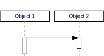

### 3.d. Incremental activation

- Any object can be activated any number of times.
- At the end of the diagram, all still active objects are
  automatically deactivated.

```umlsequence 03d.svg
O : Object

O+
:
O+
:
O+
:
O-
```


## 4. Lifeline termination and object destruction

- Use `ID~` to destroy an object.
- Use `ID#` to terminate the lifeline of an object. It means that the
  object still exists, but we no longer represent it.
- If another object is created, it will use the freed column.

```umlsequence 04.svg
O1 : Object 1
O2 : Object 2

# Terminate object 1
O1#


# Create object 3 re-using column of object 1
O3 : Object 3

# Destroy object 2
O2~


# Create object 4 re-using column of object 2
O4 : Object 4
```
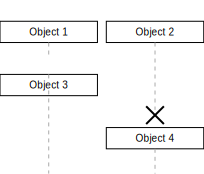

## 5. More on object creation and destruction

- Use `ID2 :` to create a placeholder for an object created later.
- Use `ID1 :> ID2 Display name` to generate a creation message.
- Use `ID1 #> ID2` to generate a destruction message.

```umlsequence 05.svg
O1 : Object 1
O2 :

# Creation message:
O1 :> O2 Object 2

# Destruction message:
O1 #> O2

```


## 6. Constraints

- Use `{TEXT}` to add a constraint to the last-created object.
- Use `ID {TEXT}` to add a constraint to the lifeline of an object.
- Use `ID _{TEXT}` to add a constraint to the lifeline of an object, one step below.

Note: we double the `{}` so that the inner curly braces are displayed.
```umlsequence 06.svg
O1 : Object 1
{{Constraint on Object 1}}
O2 : Object 2

O1 -> O2
O2 {{Constraint}}
O2 _{{Constraint below}}
```


## 7. More on messages

### 7.a. Message text alignment on arrow

- As seen before, when using `ID -> ID TEXT` the text is centered by
  default.
- Use `ID -> ID <(>TEXT` to left-align the text.
- Use `ID -> ID <)>TEXT` to right-align the text.

```umlsequence 07a.svg
O1 : Object 1
O2 : Object 2

O1 -> O2 centered
O1 -> O2 <(>left
O1 -> O2 <)>right
```
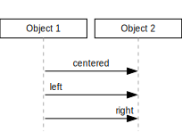

### 7.b. Self-activation message
- Use `ID > TEXT` to generate a self-activation message.

```umlsequence 07b.svg
O : Object
O > self-activation
```
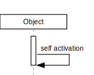

### 7.c. Request+return message

- Use `ID => ID TEXT1=TEXT2` to generate request and return messages,
  with message texts, and activation of target object.

```umlsequence 07c.svg
O1 : Object 1
O2 : Object 2

O1 => O2 return=request
```


You can omit either side of the `=`:
```umlsequence 07c2.svg
O1 : Object 1
O2 : Object 2

O1 => O2 =request
O1 => O2 return=
```
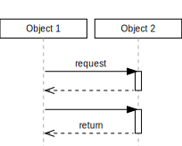

## 8. Comments

### 8.a. Simple comments

- Use `ID // TEXT` to add a comment to the lifeline of an object.
- Comments do not advance the time.

```umlsequence 08a.svg
O : Object
:
O // comment
```
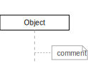

### 8.b. Multi-line comments

- Comment text can be continued on the next line by ending the line
  with `\`.
- Use `\n` to insert a newline in the text.

```umlsequence 08b.svg
O : Object
:
O // comment \n\
     on multiple \
     lines
```


### 8.c. Comment placement

- To shift the comment box, prefix the text with `[, KEY VALUE...]`,
- where KEY can be `up`, `down`, `left` or `right`,
- and VALUE is in cm.

```umlsequence 08c.svg
O1 : Object 1
O2 : Object 2

:
O1 // [,down .6 right 1.75]comment 2
O2 // [,up .1 left .3]comment 1
:
```


### 8.d. Attaching to existing comment

- First, you need to name a comment: prefix the text with `[CID]`.
- Then, use `ID // [CID]` to attach the lifeline to the previously
  defined comment.

```umlsequence 08d.svg
O1 : Object 1
O2 : Object 2
:
O2 // [C1, down .2 left .3] comment
:
O1 // [C1]
:
O2 // [C1]
```
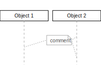

## 9. Frames

### 9.a. Basic frame

- Use `FID [ ID1 LABEL` to begin a named frame from object ID1,
- and `ID2 ] FID` to end a frame, enclosing object ID2.

```umlsequence 09a.svg
O1 : Object 1
O2 : Object 2

Frame1 [ O1  My frame

# Frame content:
O1 => O2 return=request

O2 ] Frame1
```
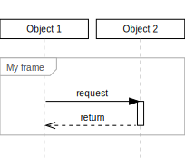

### 9.a. Frames overlapping

- Frames may overlap.
- As long as they are distinct in time, you can reuse the same frame
  ID.

```umlsequence 09b.svg
O1 : Object 1
O2 : Object 2
O3 : Object 3

# Overlapping frames:
Frame1 [ O1     Frame 1
Frame2 [ O2     Frame 2
O2     ] Frame1
O3     ] Frame2
:

# Re-using FID:
Frame  [ O1      Frame
O1     ] Frame
Frame  [ O1      Frame, again
O1     ] Frame
Frame  [ O1      Frame, yet again
O3     ] Frame
```
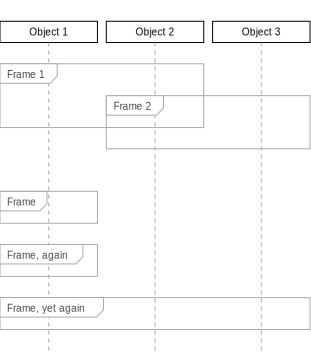


### 9.b. Frames nesting

When nesting frames, you can alter the width to improve clarity.

- To grow a frame, prefix the label with `[out VALUE]`,
- To shrink a frame, prefix the label with `[in VALUE]`,
- with VALUE in cm.

```umlsequence 09c.svg
U  * User
O1 : Object 1
O2 : Object 2

Frame1 [ O1  [out .4]Outer frame
Frame2 [ O1  Frame
Frame3 [ O1  [in .4]Inner frame

O2     ] Frame3
O2     ] Frame2
O2     ] Frame1
```
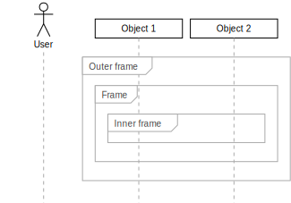
