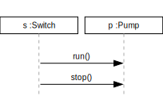
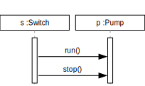
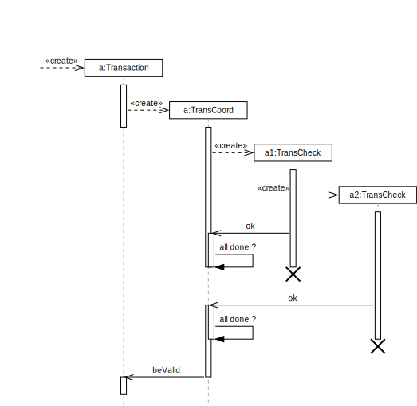
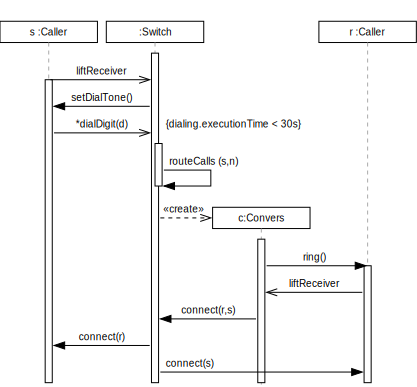
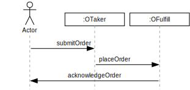
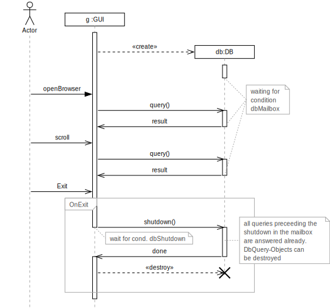

# Umlsequence Examples

All diagrams in this directory were creating by running:
```
umlsequence2 README.md -m
```

## 01 - Defining a Simple Sequence Diagram
```umlsequence example-01.svg
S : s:Switch
P : p:Pump

S -> P run()
S -> P stop()
```


(Inspired from http://www.spinellis.gr/umlgraph/doc/seq-simple.html)

## 02 - An Improved Sequence Diagram
```umlsequence example-02.svg
S : s:Switch
P : p:Pump

S+ P+
S -> P run()
S -> P stop()
```


## 03 - Creating and Destroying Objects
```umlsequence example-03.svg
S : s:Switch
P : p:Pump
F :

S+ P+
S  -> P  run()
P  :> F+ f:Flow
S  -> P  stop()
P  #> F
```


(Inspired from http://www.spinellis.gr/umlgraph/doc/seq-cd.html)

## 04 - Nested Activation and Complex Interactions
```umlsequence example-04.svg
# objects definitions
E : # External Messages
T : t:thread
O : :Toolkit
P :

# messages and activations
E  -> T+ a1:run(3)
T  -> O+ run()
O        >callbackLoop()

# creation
O+ :> P  p:Peer

# message with response
O- => P  result=handleExpose()

# destruction
O  #> P

# deactivation
T- O-
```


(Inspired from http://www.spinellis.gr/umlgraph/doc/uml-appa.html)

## 05 - Concurrent Processes and Activations
```umlsequence example-05.svg
E : #External actor
T :
TC :
TC1 :
TC2 :

E   :>  T+   a:Transaction
T-  ?:> TC+  a:TransCoord
TC  ?:> TC1+ a1:TransCheck
TC  ?:> TC2+ a2:TransCheck
TC  <-? TC1  ok
:
TC  >all done ?
:
TC- TC1~
:
TC+ <-? TC2  ok
:
TC >all done ?
TC2~
T!  <-? TC-  beValid
```


(Inspired from http://www.spinellis.gr/umlgraph/doc/dist-52.html)

## 06 - Create and Destroy
```umlsequence example-06.svg
C : c:Client
T : #:Transaction
P : p:ODBCProxy

C+
C  :> T Transaction
{{Transient}}
C  -> T+ setActions (a,d,o)
T  -> P! setValues (d,3.4)
T  -> P! setValues (a,"CO")
C  <= T- committed
C- #> T
```


(Inspired from http://www.spinellis.gr/umlgraph/doc/uml-182.html)

## 07 - Lifeline Constraints
```umlsequence example-07.svg
S : s:Caller
W : :Switch
C : #c:Convers
R : r:Caller

W+
S+ ?-> W  liftReceiver
S  <-  W  setDialTone()
S  ?-> W  *dialDigit(d)
W  {{dialing.executionTime < 30s}}
W  >routeCalls(s,n)
W  :>  C+ c:Convers
C  ->  R+ ring()
C  <-? R  liftReceiver
W  <-  C  connect(r,s)
S  <-  W  connect(r)
W  ->  R  <(> connect(s)

```


(Inspired from http://www.spinellis.gr/umlgraph/doc/uml-184.html)

## 08 - External Actor
```umlsequence example-08.svg
A * Actor
T : :OTaker
F : :OFulfill

A  -> T <)>submitOrder
T  -> F <(>placeOrder
A  <- F acknowledgeOrder
```


(Inspired from http://www.spinellis.gr/umlgraph/doc/uml-71.html)

## 09 - A DNS Query
```umlsequence example-09.svg
WB : :Web Bowser
WK : :Workstation Kernel
SK : :Server Kernel
DS : :DNS Server

WB+ WK+ SK+ DS+
SK  <- DS- select
WB  -> WK  socket
WB  -> WK  connect
WB  -> WK  sendto
WK  -> WK  send packet
WK  -> SK  DNS A query
WB- -> WK  recvfrom
SK  -> SK  receive packet
SK  => DS+ select returns
SK  <- DS  recvfrom
SK  <- DS  sendto
SK  -> SK  send packet
WK  <- SK  DNS A reply
WK  -> WK  receive packet
WB+ <= WK  recvfrom returns
WB- -> WK  close
WB# WK# SK# DS#
```


(Inspired from http://www.spinellis.gr/umlgraph/doc/dns.html)

## 10 - Comments and Frames
```umlsequence example-10.svg
A * Actor
G : g:GUI
SPACER :
D : #db:DB

G+
G  :>  D db:DB
D!
D  //[C1,down 1 right .25] waiting for \n condition \n dbMailbox
A  -> G  openBrowser
G  ?-> D+ query()
G  <-? D- result
D  //[C1]
A  ?-> G  scroll
G  ?-> D+ query()
G  <-? D- result
D  //[C1]
A  ?-> G  Exit

Frame [ G OnExit
G- ?-> D+ shutdown()
G  //[,down .2 right .25] wait for cond. dbShutdown
:
D  // all queries preceeding the \n\
      shutdown in the mailbox \n\
      are answered already. \n\
      DbQuery-Objects can \n\
      be destroyed
G+ <-? D- done
G  #>  D
:
D  ] Frame
:
G-
```


(Inspired from http://www.spinellis.gr/umlgraph/doc/gui-db.html)
